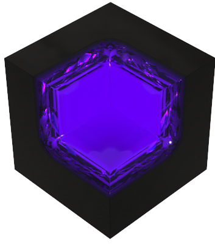

<!--
Hey, thanks for using the awesome-readme-template template.  
If you have any enhancements, then fork this project and create a pull request 
or just open an issue with the label "enhancement".

Don't forget to give this project a star for additional support ;)
Maybe you can mention me or this repo in the acknowledgements too
-->

  
  <h1>Var Menu</h1>
  
  

    Var Menu is awsome ong!
  

  
  
<!-- Badges -->

   
<h4>
    <a href="https://discord.gg/PVDQzgkPTD">discord</a>
   
  </h4>

  This menu is gonna be awsome once we have members, accounts and more developers!

 

